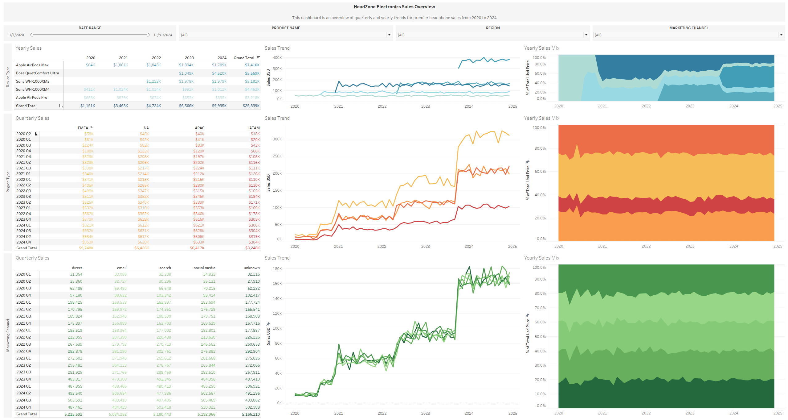

# HeadZone Headphone Sales Performance Dashboard (2020-2024)

## Executive Summary
This project analyzes synthetic headphone sales (2020–2024) using Python, SQL, and Tableau to uncover product, regional, and marketing factors influencing performance. I developed a KPI-driven dashboard to visualize sales trends, identify growth opportunities, and provide actionable business recommendations. Interactive Tableau dashboard can be found [here](https://public.tableau.com/views/headzone_electronics_sales/salesDashboard?:language=en-US&:sid=&:redirect=auth&:display_count=n&:origin=viz_share_link)

## North Star Metrics and Dimensions
- USD_PRICE: Price that the product was sold at (in USD)
- PURCHASE_TS: Timestamp of when the product was purchased
- PRODUCT_NAME: Apple AirPods Max, Apple Airpods Pro, Sony WH-1000XM4, Sony WH-1000XM5, Bose QuietComfort Ultra
- MARKETING_CHANNEL: direct, email, search, social_media, unknown
- REGION: Asia Pacific (APAC), North America (NA), Latin America (LATAM), Europe, Middle East, Africa (EMEA)

## Summary of Insights

### Overall Sales (USD)
- Initial sales surge aligns with the COVID period, with notable spikes in **July-Aug 2020**, **Nov 2020-Jan 2021**, and **Sept-Oct 2023**. 
- Since Oct 2023, sales have stabilized at **~$800K/month**, indicating a transition into a steady growth phase.
- Consistent seasonal dips observed in Jan-Feb across multiple years:
  - **Jan-Feb 2021**: **-18.4%**
  - **Jan-Feb 2022**: **-11.7%**
  - **Jan-Feb 2023**: **-7.9%**
  - **Jan-Feb 2024**: **-10.5%**
- There are visible Q4 spikes where steep rises in late 2020 and especially **Sept-Oct 2023**# HeadZone Headphone Sales Performance Dashboard (2020-2024)

---

### Products
- In 2024, **Bose QuietComfort Ultra** is the top seller, followed by the **Sony WH-1000XM5** and **Apple AirPods Max** - all recent releases, highlighting consumer preference for new flagship products.
- AirPods Max are priced $100 more than competitors, but was purchased **3x less** than the Bose QuietComfort Ultra and **2x less** than Sony WH-1000XM5.
- Sales dips are disproportionately driven by more **premium items** (AirPods Max, Bose, Sony XM5s), while **lower-cost products** (AirPods Pro) do not offset these losses.
- Example: The most expensive product in the market from **Jan-Feb 2021**, Sony XM5, witnessed a **27%** decrease in sales which drove the **18.4%** overall dip.

---

### Region
- EMEA is consistently the highest-contributing region and should be viewed as the company's growth engine.
- LATAM consistently ranks lowest in sales contribution
- All regions show broadly similar growth trends but express varied exposure to dips per product:

**Apple AirPods Max**
  - **Feb 2021**: APAC (–39%), LATAM (–33%)
  - **Feb 2022**: NA (–29%), EMEA & APAC (~–20%)
  - **Feb 2024**: NA & APAC (–35% each), EMEA (+5.7%)

**Bose QuietComfort Ultra**  
  - **Feb 2024**: LATAM (-20%), EMEA (-12%)

**Sony XM5**
  - **Feb 2024**: APAC (+19%), NA & EMEA (-15%)

---

### Marketing Channels
- No single dominant channel - all channels track similar growth trends, suggesting the multi-channel strategy is balanced and effective
- However, specific dips are channel- and product-specific:
  - **AirPods Max**: Direct channnel hit -37% (Feb 2021), -30% (Feb 2024); Email channel -42% (Feb 2022)
  - **Bose QuietComfort Ultra**: Social Media -25.9% (Feb 2024)
  - **Sony XM5**: Email Channel -21% (Feb 2024) 

--- 

## Recommendations & Next Steps

- **Capitalize on Q4 marketing campaigns**, especially for flagship headphones or highly anticipated releases to capture the seasonal demand surge
- **Leverage EMEA as a growth engine** by expanding inventory of premium products in that region, while investigating strategies for LATAM, where sales consistently lag all around.
- **Maintain the current balanced multi-channel approach**, as all channels consistently contribute to overall revenue. We could consider targeted interventions in channels that experience sharp dips for a given product.
  - **Understand the Unknown channel** and whether we can trace which channel these orders come from. It may reveal a pattern that would've otherwise been looked over. 
- **Position lower-cost products as stability drivers** to offset volatility from premium models during seasonal downturns
- **Explore whether dropping the price of AirPods Max** will positively affect its overall sales. Its pricepoint is $100 more than its competitors that have recently released but is ordered significantly less  

## Limitations
This dataset is transaction-based, so analysis focuses on orders rather than individual customer behavior. Due to the nature of the dataset being synthetically made, there are some variables that may be typically found in these kinds of datasets but is absent and not initially accounted for. For example, I did not generate data pertaining an inventory of the products.
This means that I don't have a metric of the acquisition cost per unit to perform profit analysis. The same can be said for advertisement spending or campaign costs. As a result of the natural limitation of my dataset, the overall analysis is self-contained in the revenue metric and would require both a regeneration and rethinking of the overall dataset. 
Lastly, since the project uses a synthetic dataset, it is meant to mimic real-world headphone sales but does not reflect actual business transactions. Insights should depict a sense of methodology rather than definitive business outcomes, ultimately, a learning experience on business adjacent data.
